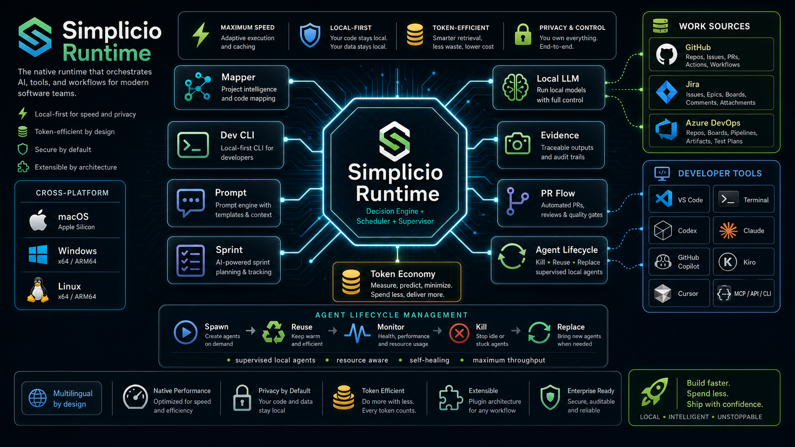

# Simplicio agent plugin



This multi-host package preserves the native Codex plugin and adds official
portable Agent Plugins v1, Claude Code, and Gemini CLI manifests. Every package
starts the same verified Simplicio Runtime bootstrap, exposes its live MCP
surface, and ships the same governed Simplicio skills.

## Host packages

| Host family | Entry point | Contract |
|---|---|---|
| Codex | `.codex-plugin/plugin.json` | Native Codex plugin |
| Claude Code | `.claude-plugin/plugin.json` | Native Claude Code plugin |
| Cursor, GitHub Copilot, Kiro, Qwen Code | `plugin.json` + `mcp.json` | Agent Plugins v1 |
| Gemini CLI | `gemini-extension.json` | Native Gemini extension |
| Hermes Agent | `../simplicio-hermes/plugin.yaml` | Native Hermes Python plugin |
| Other CLI/IDE/agent harnesses | Runtime `mcp register` | MCP/config or guided integration |

The package does not pretend every product has the same plugin API. The
machine-readable `host-surfaces.json` records the supported surface for all 32
Runtime host contracts. Native pre-hooks remain Runtime-managed so they can be
installed transactionally, preserve unrelated host configuration, and stay
version-aligned with the running binary.

## Automatic Runtime bootstrap

The bundled MCP server performs an idempotent bootstrap when a supported host
first activates the package:

1. Reuse a valid Simplicio Runtime meeting `POLICY.minimumRuntimeVersion` in `bin/simplicio-mcp-bootstrap.js` when one is already present.
2. Otherwise download the official installer from an immutable repository
   commit and verify the installer SHA-256 before execution.
3. Install the pinned Runtime release through its fail-closed SHA-256 and
   Ed25519 release checks.
4. Start `simplicio serve --mcp --stdio --no-facade-mode` with stdout reserved
   exclusively for MCP JSON-RPC.

The managed binary is installed at `~/.simplicio/bin/simplicio`. Existing valid
installs at `~/.local/bin/simplicio` are reused. Concurrent starts share an
installation lock, and diagnostics go to
`~/.simplicio/logs/codex-plugin-bootstrap.log`.

The Runtime supports macOS arm64/x64, Linux x64, and Windows x64. The plugin
launcher requires Node.js 18 or newer to be available to Codex MCP processes.
The official Unix installer additionally requires Python 3 and either curl or
wget. The current package is live-tested on macOS arm64; the other targets use
the same official installers but still require platform-matrix verification.

## Authentication

Installation never starts an account flow or consumes MCP stdin. Tool schemas
can load before login, while protected calls fail closed until the user
explicitly authenticates:

```bash
$HOME/.simplicio/bin/simplicio login google --json
$HOME/.simplicio/bin/simplicio auth status --json
```

## Commands and tools

The plugin does not hard-code a stale command list. The Runtime advertises its policy-governed MCP surface dynamically, so plugin
validation checks required capabilities by name instead of freezing a tool
count. `simplicio_exec` is the governed supertool for every valid
Simplicio CLI subcommand; individual CLI commands are not duplicated as separate plugin definitions.

Included skills:

- `simplicio-runtime`: map, recall, edit, execute, and validate through live MCP
  schemas, with the Runtime capability and interface contracts bundled locally.
- `simplicio-setup`: verify bootstrap, authentication, repair, and explicit
  global host registration.
- `simplicio-mapper`: survey repositories and produce bounded, revision-aware
  context before implementation.
- `simplicio-fast`: accelerate indexed, cache-aware, read-only retrieval while
  preserving Mapper provenance and freshness checks.
- `simplicio-dev-cli`: perform deterministic edits, tests, diagnostics, and
  evidence-backed validation through the Dev CLI contract.
- `simplicio-loop`: orchestrate multi-step work with bounded stages, retries,
  fan-out, recovery, and convergence.
- `simplicio-prism`: route mixed work across Mapper, Fast, Dev CLI, Loop, and
  Runtime using the bundled capability inventory and recipes.
- `simplicio-cli`: optional local tooling for the Simplicio six-layer
  task-to-code verification workflow.

The five component skills include their upstream `references/`, `agents/`,
`assets/`, and Prism helper files so Codex can use the same system contracts
without importing Runtime source code. The plugin intentionally bundles only
Simplicio first-party system skills, not the Runtime's unrelated external skill
catalog.

Source and official artwork:
<https://github.com/wesleysimplicio/simplicio> and the Simplicio Runtime source
repository.

The host-side plugin material is MIT-licensed. The separately distributed
Simplicio Runtime and release artifacts retain their repository license.
